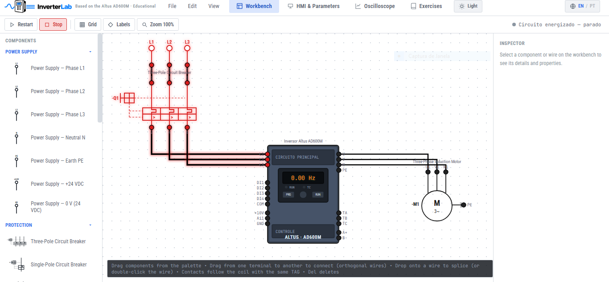
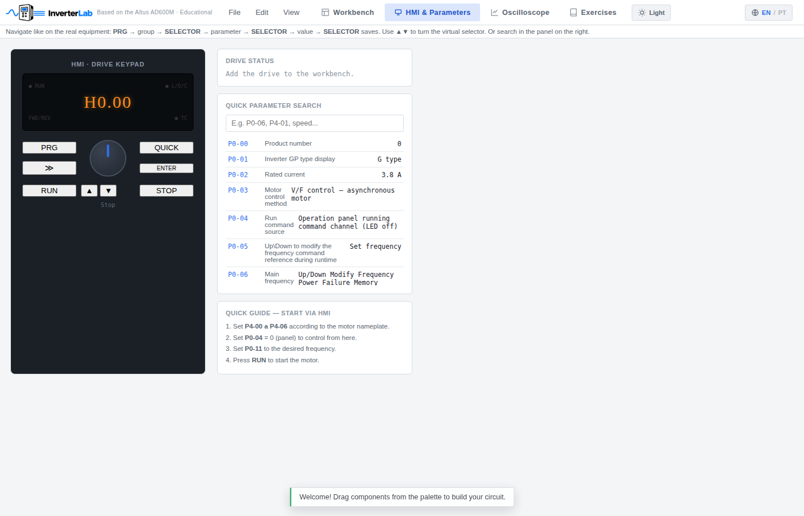
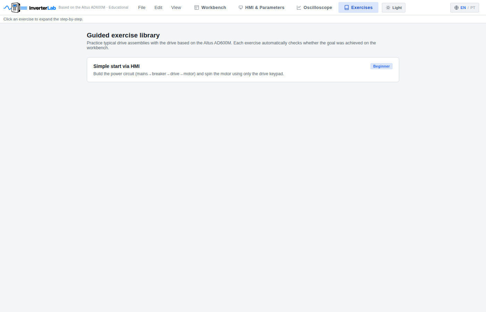

<p align="center">
  
</p>

<p align="center">
  <strong>Simulador educacional de inversores de frequência, baseado no Altus AD600M</strong><br>
  Monte circuitos de comando com simbologia elétrica real, parametrize o inversor pela IHM e veja o motor girar — tudo no navegador, sem instalar nada.
</p>

<p align="center">
  <a href="#">Acessar o InverterLab »</a>
  <!-- troque o link acima pela URL do GitHub Pages assim que o repositório estiver publicado -->
</p>

---

## O que é

O **InverterLab** nasceu de uma necessidade simples: depois de uma aula sobre inversores de frequência (usando o Altus AD600M) em um curso técnico, não havia nenhuma ferramenta gratuita para continuar praticando em casa — montar o circuito de comando, ligar os terminais certos e ajustar os parâmetros sem precisar do equipamento físico.

O InverterLab preenche essa lacuna: é uma bancada virtual onde você arrasta componentes elétricos (botoeiras, contatores, disjuntores, sensores, motor), liga os fios seguindo a simbologia padrão NBR/IEC, e simula o circuito com o inversor Altus AD600M de verdade — IHM funcional, parâmetros reais do manual, curva V/F, e o caminho da corrente destacado visualmente enquanto o circuito está energizado.

Todo o projeto roda num único arquivo HTML, direto no navegador, sem instalação, sem backend e sem necessidade de internet depois do primeiro carregamento (funciona offline via Service Worker).

## Funcionalidades

- **Bancada de montagem** com paleta de componentes organizada por categoria (Alimentação, Proteção, Inversor, Motor, Comando, Sensores, Sinalização), usando simbologia elétrica padrão (NBR/IEC) — contatos NA/NF, bobinas de contator, disjuntores, motor trifásico, sensores indutivos/capacitivos, fim de curso, sinaleiros.
- **Fiação ortogonal** com emendas (nós), arraste de terminais, e edição completa (desfazer/refazer, duplicar, excluir) enquanto a simulação está parada.
- **Simulação elétrica em tempo real**: ao iniciar, o circuito é energizado e o caminho da corrente é destacado visualmente nos fios e componentes condutores — permitindo visualizar como a energia se propaga pelo circuito de comando até acionar o motor.
- **Inversor Altus AD600M completo**: réplica da IHM física (teclado PRG/SELETOR/RUN/STOP), navegação por grupos de parâmetros igual ao equipamento real, busca rápida de parâmetros, e um painel de controle que pode ser aberto a qualquer momento clicando no próprio inversor na bancada.
- **Motor de indução trifásico parametrizável**: edite a plaqueta de dados (potência, tensão, corrente, frequência, velocidade, número de polos, fator de potência, rendimento) e veja o comportamento do motor responder de acordo.
- **Osciloscópio**: gráficos em tempo real de frequência de saída, corrente, tensão e velocidade do motor.
- **Biblioteca de exercícios guiados**: montagens típicas (como partida via IHM) com verificação automática de objetivo atingido.
- **Interface bilíngue** (Português / English), com tema claro e escuro.
- **Funciona offline**: depois do primeiro acesso, o Service Worker mantém o simulador disponível sem internet — útil para uso em laboratórios ou salas sem rede estável.
- **Salvar/abrir projetos** em `.json` e exportar o diagrama do circuito como imagem `.svg`.

## Capturas de tela

<p align="center">
  <br>
  <em>Bancada de montagem — circuito de partida direta energizado, com o caminho da corrente destacado.</em>
</p>

<p align="center">
  <br>
  <em>IHM & Parâmetros — réplica do teclado físico, navegação por grupos e busca rápida de parâmetros.</em>
</p>

<p align="center">
  <br>
  <em>Osciloscópio — frequência, corrente, tensão e velocidade do motor em tempo real.</em>
</p>

<p align="center">
  <br>
  <em>Exercícios guiados com verificação automática de objetivo.</em>
</p>

## Como usar

Não é necessário instalar nada. Basta abrir o `index.html` em qualquer navegador moderno (Chrome, Edge, Firefox) — ou acessar a versão publicada:

**[Acessar o InverterLab online »](#)**
<!-- substitua pelo link do GitHub Pages -->

Para rodar localmente a partir do repositório clonado, qualquer servidor estático funciona, por exemplo:

```bash
git clone https://github.com/caiobondarchuk/inverterlab.git
cd inverterlab
python3 -m http.server 8080
# depois abra http://localhost:8080 no navegador
```

> Abrir o `index.html` diretamente com duplo clique (`file://`) também funciona para uso pessoal, mas o Service Worker (que habilita o uso offline) só é registrado corretamente quando o site é servido por `http://` ou `https://`.

## Estrutura do projeto

```
inverterlab/
├── index.html              # aplicação completa (HTML + CSS + JS em um único arquivo)
├── manifest.webmanifest     # manifesto PWA (ícone, nome, cores)
├── sw.js                    # Service Worker — habilita uso offline
├── _nojekyll                 # evita que o GitHub Pages processe o site com Jekyll
├── icons/                   # ícones do PWA em diferentes tamanhos
└── scripts/
    └── baixar-fontes.js     # utilitário Node opcional: baixa as fontes do Google Fonts
                              # localmente, deixando o simulador 100% offline
```

### Sobre o `scripts/baixar-fontes.js`

Por padrão, o InverterLab carrega as fontes (Roboto Condensed e JetBrains Mono) do Google Fonts pela internet. Esse script opcional baixa essas fontes e as referencia localmente, para quem quiser um pacote totalmente independente de internet (por exemplo, para distribuir em computadores de laboratório sem acesso à rede). Requer Node.js instalado:

```bash
node scripts/baixar-fontes.js .
```

## Tecnologias

Construído inteiramente com **HTML, CSS e JavaScript puro** — sem frameworks, sem dependências de build. A ideia é que o projeto inteiro seja um único arquivo portátil, fácil de auditar, modificar e distribuir.

## Aviso legal

Este é um **projeto educacional independente e não oficial**, sem qualquer vínculo com a Altus Sistemas de Automação S.A. O simulador foi desenvolvido com base em manuais técnicos públicos do inversor Altus AD600M para fins de ensino. Nomes, marcas e modelos mencionados pertencem aos seus respectivos titulares.

## Autores

Desenvolvido por:

- **Caio Bondarchuk** — [github.com/caiobondarchuk](https://github.com/caiobondarchuk)
- **Breno Rossi** — [github.com/brossi73](https://github.com/brossi73)

## Licença

Este projeto está licenciado sob a [MIT License](LICENSE).

Copyright (c) 2026 Caio Bondarchuk and Breno Rossi
